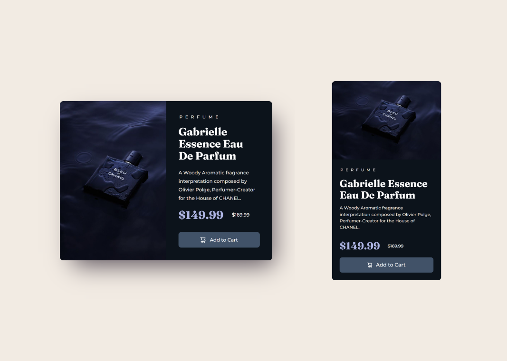

# 🤖 Product preview card component solution ❄️

## Layout

The designs were created to the following widths:

- Desktop: 1440px
- Mobile: 375px

### Links

- Solution URL: [https://github.com/eigdoyr/product-preview-card](https://github.com/eigdoyr/product-preview-card)
- Live Site URL: [https://eigdoyr-product-preview-card.netlify.com](https://eigdoyr-product-preview-card.netlify.com)

## Built with

- [Vue](https://vuejs.org/) - JS library
- Semantic HTML5 markup
- CSS custom properties
- Flexbox
- CSS Grid
- Mobile-first workflow

## IDE Setup

[VSCode](https://code.visualstudio.com/) + [Volar](https://marketplace.visualstudio.com/items?itemName=Vue.volar) (and disable Vetur) + [TypeScript Vue Plugin (Volar)](https://marketplace.visualstudio.com/items?itemName=Vue.vscode-typescript-vue-plugin).

## Customize configuration

See [Vite Configuration Reference](https://vitejs.dev/config/).
